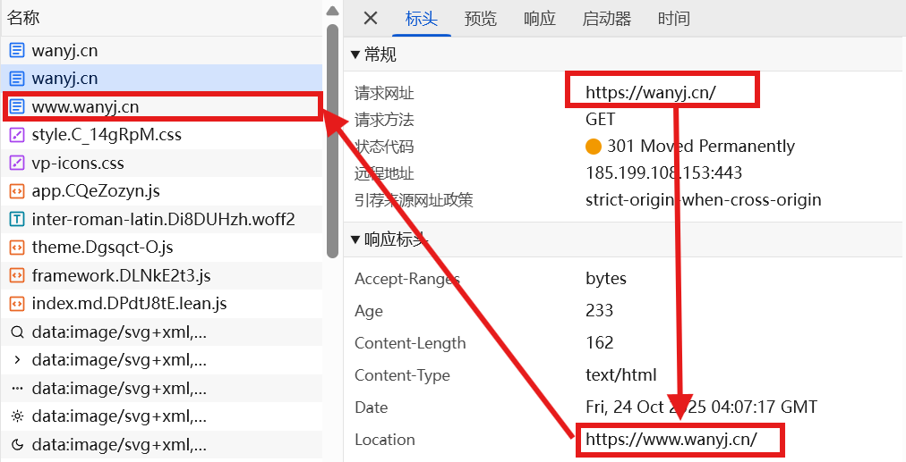

# Github Page 自定义域名
 
 
 
 

## 1. 环境准备
**step1**：首先要拥有一个域名，如果没有，购买即可

**step2**：在 github page 上成功部署网站，只不过用的是github提供的域名（用户名.github.io）

我的 github page 默认的域名是`userwanyong.github.io`

我申请的域名是`wanyj.cn`

接下来我直接用这两个域名进行说明

## 2. 改为自定义域名
接下来我们就要将`userwanyong.github.io`改为我们自己的域名`wanyj.cn`，使之输入`wanyj.cn`/`www.wanyj.cn`可以访问到 github page 部署的网站

**step1**：进入你的 github 仓库，点击 settings->pages

**step2**：在 Custom domain 栏填写你申请到的域名

这里我配置的是`www.wanyj.cn`，当然也可以用其他的`wanyj.cn`、`blog.wanyj.cn`等

**step3**：点击 Save 保存~

不出意外的情况下应该会有红色警告，不用慌，因为我们 dns 还没配置呢，接着后面步骤

**step4**：配置 dns 解析

返回到你购买域名的厂商提供的 dns 控制台，这里我用阿里为例

点击添加记录

添加一个 CNAME 记录，主机记录填 www（如果你配置的是`blog.wanyj.cn`、则应该填 blog ，如果是`wanyj.cn`则填 @ ），请求来源默认即可，记录值就是你的 github page 提供的默认请求地址`userwanyong.github.io`，点击确定

等待几分钟后使用`www.wanyj.cn`就能访问到你的网站了

**step5**：完善配置

但你回到 github page 界面，是不是又看到黄色警告了，如下图

其实这不影响你的正常访问，但看着好难受啊

解决方法：再添加一条 dns 解析，将根域名解析到 github page 的服务器即可

点击文档，看看他给你的主机地址是多少

可以看到这里他给了四个地址，我们没必要全配置，选一个配置就好了

你也可以用 AAAA 类型来配置，只是记录值变变而已

回到 github page 界面，就发现没有警告了

等他检查完，把 https 勾上，这样你就可以通过`https://www.wanyj.cn`访问了

返回到你的 github page 页面，一点警告都没有了，是不是很舒适 ^_^

## 3. 验证域
我们在翻文档的时候是不是还有个验证自定义域啊，我们来看看

<Linkcard url="https://docs.github.com/en/pages/configuring-a-custom-domain-for-your-github-pages-site/verifying-your-custom-domain-for-github-pages
" title="点击查看文档" description="https://docs.github.com/en/pages" logo="https://markdown-my.oss-cn-beijing.aliyuncs.com/picture/202508181539171.png"></Linkcard>

大体意思就是输入你的根域名`wanyj.cn`后，会给你一串 txt 文本

分别对应了主机纪录和记录值，新建一条 dns 解析填上就行

## 4. 注意点
1. 如果在此过程中还是有警告/错误，你可以尝试将以上操作都完成，也就是配置3条 dns 记录（step4、step5、验证域）
这样不用在意顺序，反正你都配置了，最终结果是一样的
2. 如果你使用的是 github page 部署，并使用了自己的域名（ `www.wanyj.cn` ），那么你访问根域名 `wanyj.cn` 的时候，也会跳转到 `www.wanyj.cn` ，因为 github 服务器会进行301重定向

