# Maven 发包
 
 
 

## 1. 注册 sonatype 账号
<Linkcard url="https://central.sonatype.com/publishing/namespaces" title="注册 sonatype 账号" description="https://central.sonatype.com" logo=""></Linkcard>

## 2. 创建 namespace
如果你使用 github 账号登录，默认会有一个命名空间 eg. `io.github.userwanyong`

如果你有自己的域名并且想要自定义 namespace 的话，继续往下看

### 2.1. 点击创建
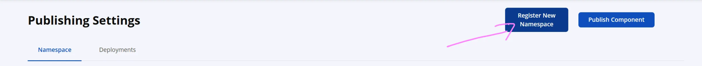

### 2.2. 填写域名的反写 
例如`cn.wanyj.component`

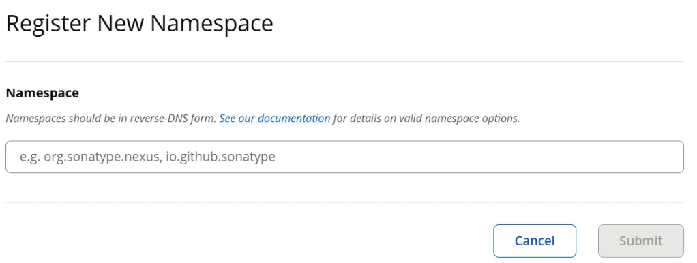
### 2.3. 验证域名

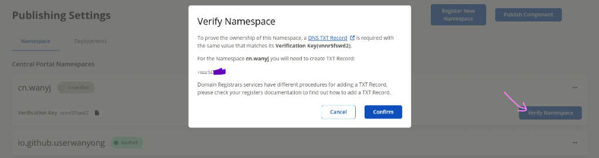

需要在对应的厂商的域名控制台添加txt记录

可参考 https://central.sonatype.org/faq/how-to-set-txt-record/#question

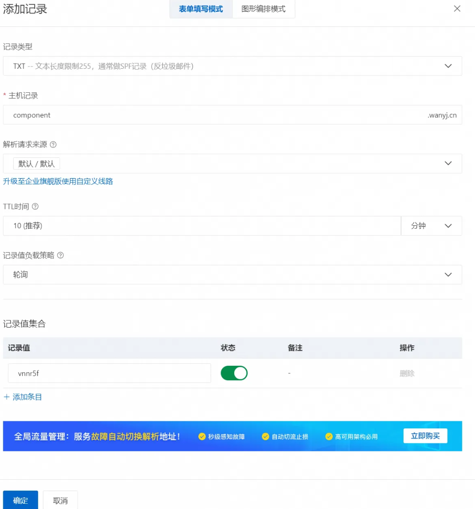

耐心等待几分钟就成功了

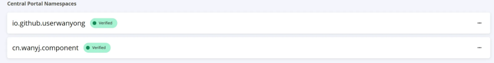

## 3. 安装配置 gpg
作用：对上传的文件进行加密签名

### 3.1. 下载安装 gpg
<Linkcard url="https://gpg4win.org/download.html" title="win 下载地址" description="https://gpg4win.org/download.html" logo="https://blog-1375280847.cos.ap-beijing.myqcloud.com/images/202508231213971.png"></Linkcard>
<Linkcard url="https://gpgtools.org/" title="mac 下载地址" description="https://gpgtools.org/" logo="https://blog-1375280847.cos.ap-beijing.myqcloud.com/images/202508231213971.png"></Linkcard>
直接用它默认的下载安装即可

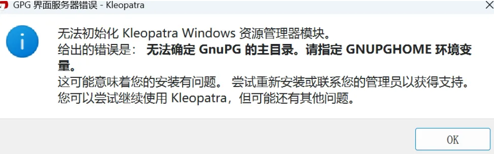

### 3.2. 这里也是出现错误了，不用管他，直接用命令行操作

- 首先在命令行输入`gpg --version`看看是否安装成功
- 然后输入`gpg --gen-key`生成密钥
  - real name 填写上面创建的命名空间 cn.wanyj.component
  - email 填写你的邮箱地址
  
然后会出现

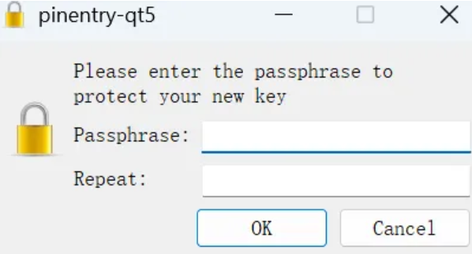

这里输入密钥，一定要记住！！！

然后返回命令行你会看到公钥`845B36F77655AACF5FB11312BB0D52AF86C349D1`

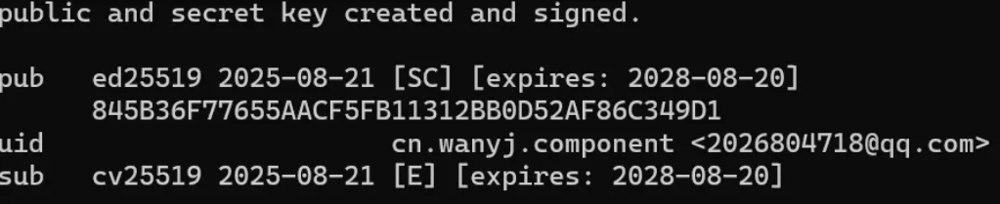

如果以后你想查看已经生成过的密钥信息，在命令行输入`gpg --list-keys`即可

最后将公钥发送到服务器供 sonatype 验证
```bash
gpg --keyserver keyserver.ubuntu.com --send-keys 845B36F77655AACF5FB11312BB0D52AF86C349D1
```
验证是否发送成功
```bash
gpg --keyserver keyserver.ubuntu.com --recv-keys 845B36F77655AACF5FB11312BB0D52AF86C349D1
```
如果发送失败多发送几次或者更换 keyserver.ubuntu.com 试试
- keyserver.ubuntu.com
- keys.openpgp.org
- pgp.mit.edu

出现下图信息即代表成功了

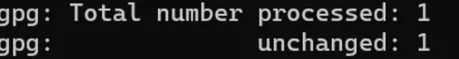


### 3.3. 配置 setting.xml 文件
<Linkcard url="https://central.sonatype.com/account" title="生成 token" description="https://central.sonatype.com/account" logo="https://blog-1375280847.cos.ap-beijing.myqcloud.com/images/202508231213971.png"></Linkcard>

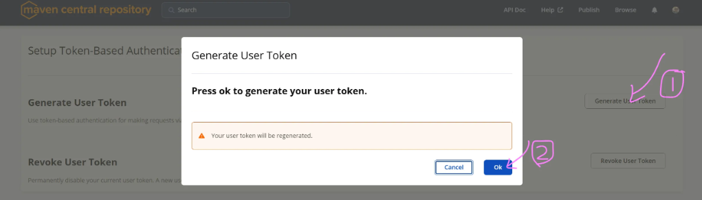

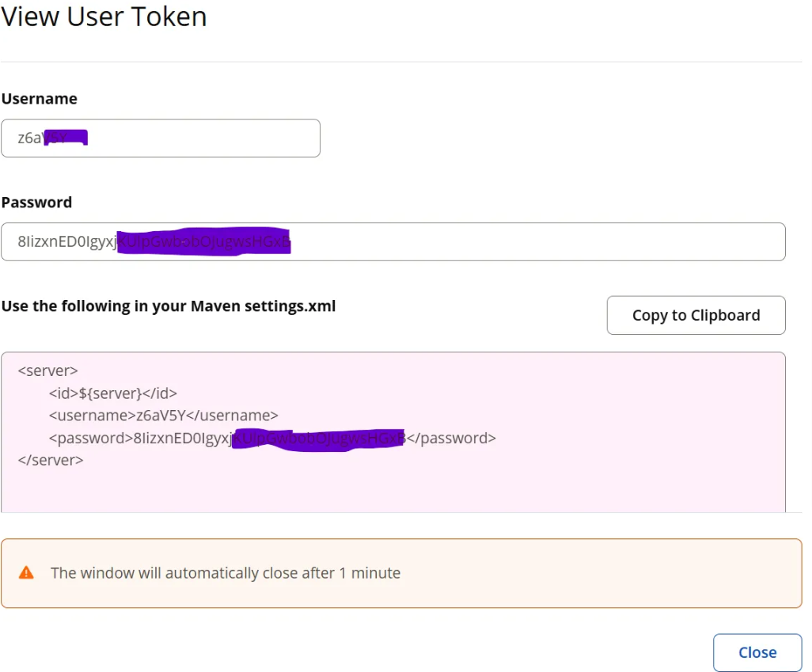

然后将以上配置放到你的setting.xml文件中，举例如下
::: code-group
```xml [setting.xml]
<servers>
    <server>
        <id>随便起一个唯一的名字即可，如zxc</id>
        <username>你的账号(点击生成；https://central.sonatype.com/account)</username>
        <password>你的密码(点击生成；https://central.sonatype.com/account)</password>
    </server>
</servers>

<profiles>
  <profile>
    <id>gpg</id>
    <activation>
      <activeByDefault>true</activeByDefault>
    </activation>
    <properties>
      <!-- <gpg.executable>gpg</gpg.executable> 如果不行，直接以下面方式指定 -->
      <gpg.executable>E:\其他资料\gpg\GnuPG\bin\gpg.exe</gpg.executable>
      <gpg.passphrase>填写，你的秘钥密码</gpg.passphrase>
    </properties>
  </profile>
</profiles>

<activeProfiles>
  <activeProfile>gpg</activeProfile>
</activeProfiles>
```
:::

## 4. 配置pom文件
在你的pom文件中增加以下配置
::: code-group
```xml [pom.xml]
<?xml version="1.0" encoding="UTF-8"?>
<project xmlns="http://maven.apache.org/POM/4.0.0" xmlns:xsi="http://www.w3.org/2001/XMLSchema-instance"
         xsi:schemaLocation="http://maven.apache.org/POM/4.0.0 https://maven.apache.org/xsd/maven-4.0.0.xsd">
    <modelVersion>4.0.0</modelVersion>

    <parent>
        <groupId>cn.wanyj.component</groupId>
        <artifactId>wanyj-component</artifactId>
        <version>1.0.0</version>
    </parent>

    <artifactId>design-pattern-framework</artifactId>

    <name>design-pattern-framework</name>
    <description>wanyj component design-pattern-framework</description>
    <url>https://github.com/userwanyong/wanyj-component</url>

    <licenses>
        <license>
            <name>Apache License</name>
            <url>https://opensource.org/license/apache-2-0/</url>
            <distribution>repo</distribution>
        </license>
    </licenses>

    <developers>
        <developer>
            <id>yong</id>
            <name>userwanyong</name>
            <email>2026804718@qq.com</email>
            <url>wanyj.cn</url>
            <roles>
                <role>Project Manager</role>
                <role>Developer</role>
            </roles>
            <timezone>Asia/Shanghai</timezone>
        </developer>
    </developers>

    <scm>
        <connection>scm:git:https://github.com/userwanyong/wanyj-component.git</connection>
        <developerConnection>scm:git:https://github.com/userwanyong/wanyj-component.git</developerConnection>
        <tag>HEAD</tag>
        <url>https://github.com/userwanyong/wanyj-component</url>
    </scm>

    <dependencies>
    </dependencies>

    <build>
        <finalName>${project.artifactId}-${project.version}</finalName>
        <!-- 编译插件 -->
        <plugins>
            <plugin>
                <groupId>org.apache.maven.plugins</groupId>
                <artifactId>maven-compiler-plugin</artifactId>
                <version>3.14.0</version>
                <configuration>
                    <source>${java.version}</source>
                    <target>${java.version}</target>
                    <encoding>${project.build.sourceEncoding}</encoding>
                </configuration>
            </plugin>
            <!-- source源码插件 -->
            <plugin>
                <groupId>org.apache.maven.plugins</groupId>
                <artifactId>maven-source-plugin</artifactId>
                <version>2.2.1</version>
                <executions>
                    <execution>
                        <id>attach-sources</id>
                        <goals>
                            <goal>jar-no-fork</goal>
                        </goals>
                    </execution>
                </executions>
            </plugin>
            <!-- javadoc插件 -->
            <plugin>
                <groupId>org.apache.maven.plugins</groupId>
                <artifactId>maven-javadoc-plugin</artifactId>
                <version>2.9.1</version>
                <configuration>
                    <charset>UTF-8</charset>
                    <encoding>UTF-8</encoding>
                    <docencoding>UTF-8</docencoding>
                    <additionalJOption>-Xdoclint:none</additionalJOption>
                </configuration>
                <executions>
                    <execution>
                        <id>attach-javadocs</id>
                        <phase>package</phase>
                        <goals>
                            <goal>jar</goal>
                        </goals>
                        <configuration>
                            <additionalparam>-Xdoclint:none</additionalparam>
                            <javadocExecutable>${java.home}/bin/javadoc.exe</javadocExecutable>
                        </configuration>
                    </execution>
                </executions>
            </plugin>
            <!-- gpg加密插件 -->
            <plugin>
                <groupId>org.apache.maven.plugins</groupId>
                <artifactId>maven-gpg-plugin</artifactId>
                <version>1.5</version>
                <configuration>
                    <!--指定用于签名的 GPG 密钥名称-->
                    <keyname>cn.wanyj.component</keyname>
                </configuration>
                <executions>
                    <execution>
                        <id>sign-artifacts</id>
                        <phase>verify</phase>
                        <goals>
                            <goal>sign</goal>
                        </goals>
                    </execution>
                </executions>
            </plugin>
            <!-- central发布插件 -->
            <plugin>
                <groupId>org.sonatype.central</groupId>
                <artifactId>central-publishing-maven-plugin</artifactId>
                <version>0.4.0</version>
                <extensions>true</extensions>
                <configuration>
                    <publishingServerId>zxc</publishingServerId>
                    <tokenAuth>true</tokenAuth>
                    <autoPublish>true</autoPublish>
                </configuration>
            </plugin>
        </plugins>
    </build>
</project>
```
:::

- maven-gpg-plugin 中`<keyname>`即为你上面填写的 real name 名称，可以使用命令行输入`gpg --list-keys`查询，结果中 [ultimate] 后面的即为`<keyname>`。如果你使用的是命名空间作为 real name 的名称，此项可以不指定
- central-publishing-maven-plugin 中`<publishingServerId>`为你 setting.xml 文件中填写的 server.id 如`zxc`
- 五个必须插件 
  - maven-compiler-plugin 插件用于编译字节码包
  - maven-source-plugin 插件用于构建源码包
  - maven-javadoc-plugin 插件用于构建文档包
  - maven-gpg-plugin 插件用于打包GPG数字签名
  - central-publishing-maven-plugin 插件用于推送包到 Maven Central

## 5. 点击 deploy 发布
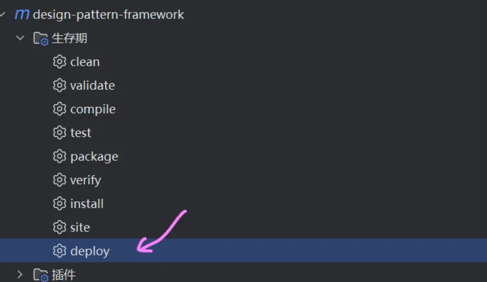

期间会让你输入`<keyname>`对应的密钥，就是你上面第三步中配置的那个，填上即可

至此，恭喜你，成功将jar包发布到了maven中央仓库！

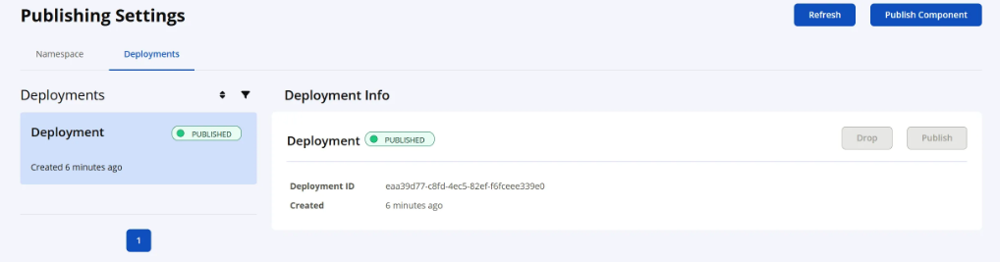
