# 灵犀助手
 

 
 
 
 

<Linkcard url="http://120.48.70.239:3636/" title="体验地址" description="http://120.48.70.239:3636/" logo="https://markdown-my.oss-cn-beijing.aliyuncs.com/picture/202508181539171.png"></Linkcard>

## 1. 项目介绍
《灵犀助手》一个集成智能问答、日志分析、发帖通知、RAG问答、模拟器等功能的AI智能助手
## 2. 技术栈
- Springboot
- Mysql
- Pgvector
- Redis
- Elasticsearch
- Logstash
- Kibana
## 3. 项目展示
### 3.1. 登录
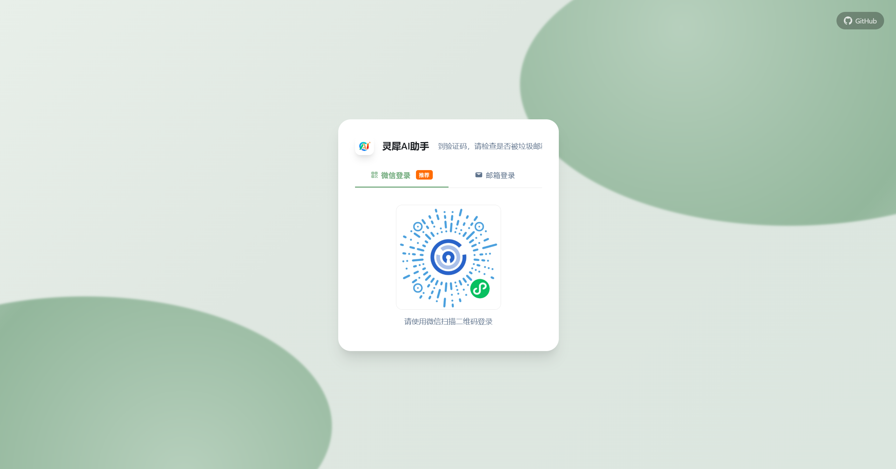
### 3.2. 个人中心
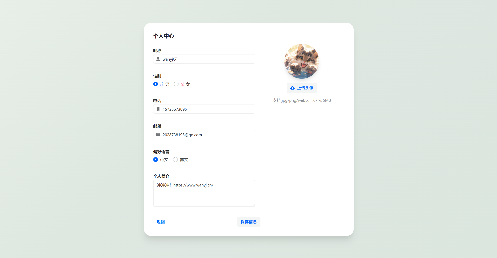
### 3.3. 修改密码
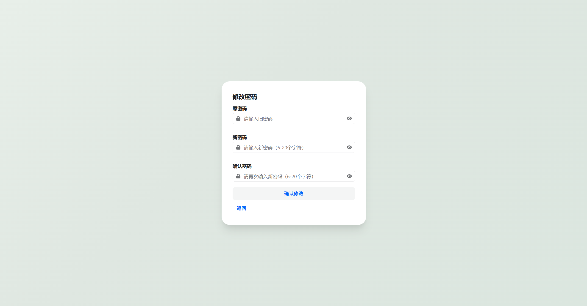
### 3.4. 首页
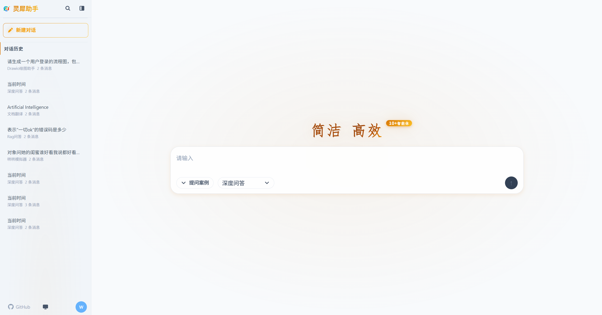
### 3.5. 智能体-普罗米修斯助手
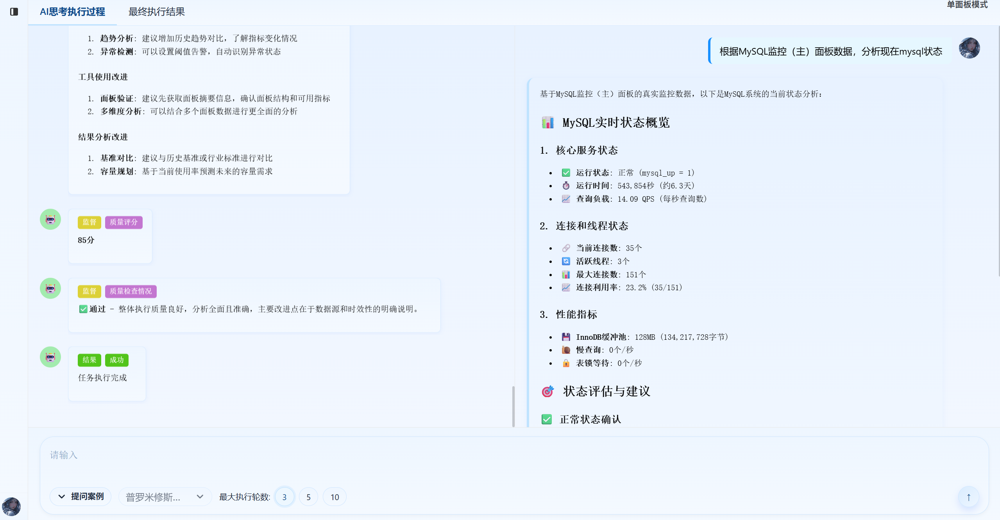

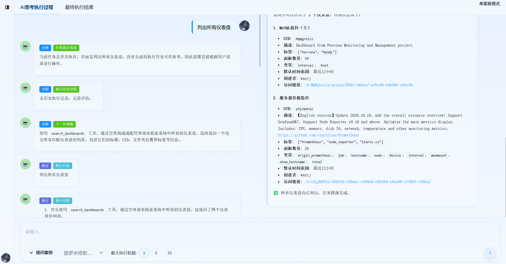
### 3.6. 智能体-ELK日志分析
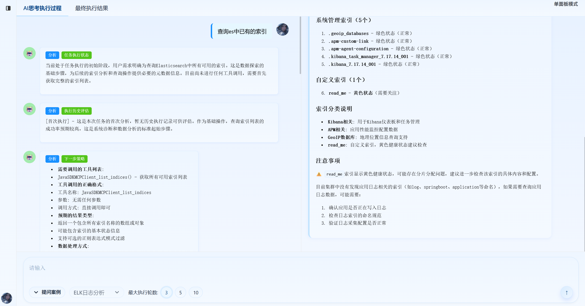
### 3.7. 智能体-发帖通知
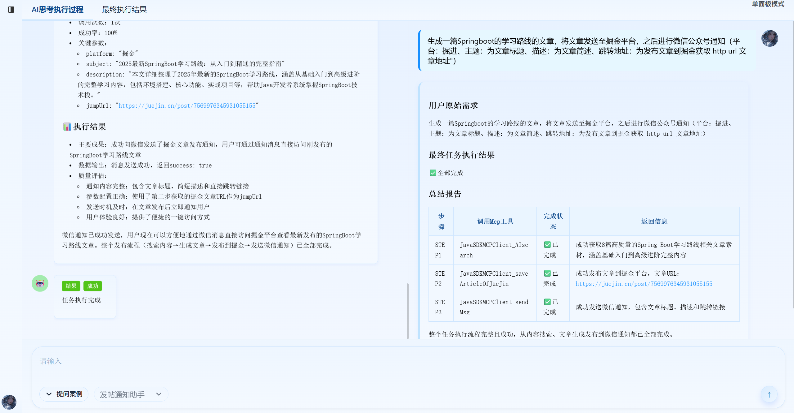
### 3.8. 智能体-RAG问答
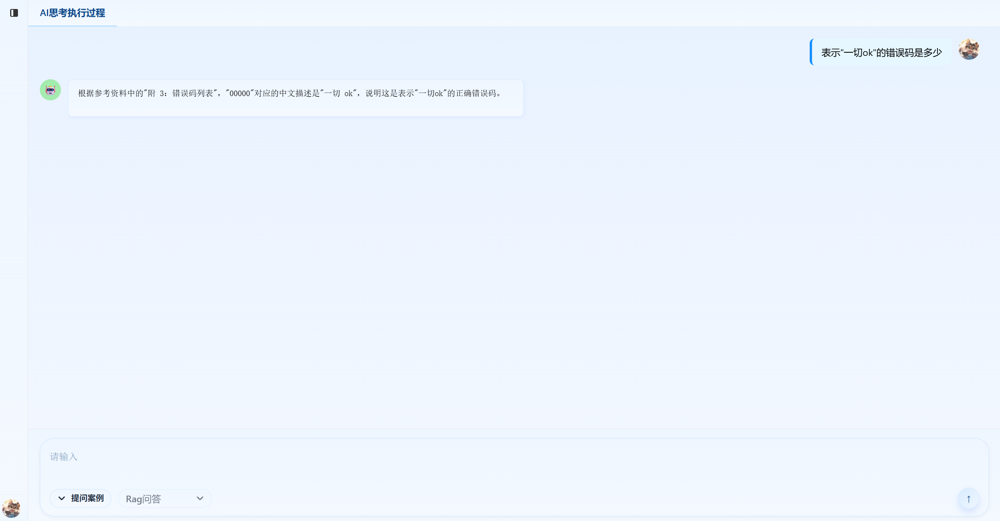
### 3.9. 智能体管理
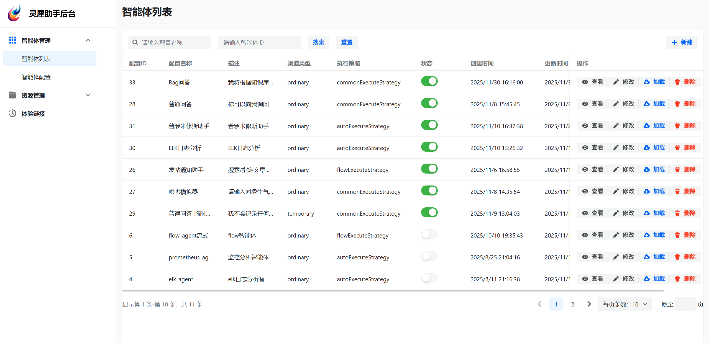

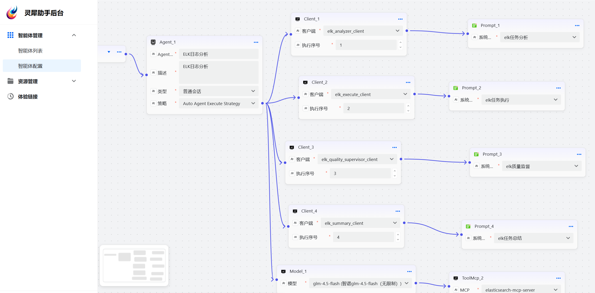
### 3.10. 资源管理
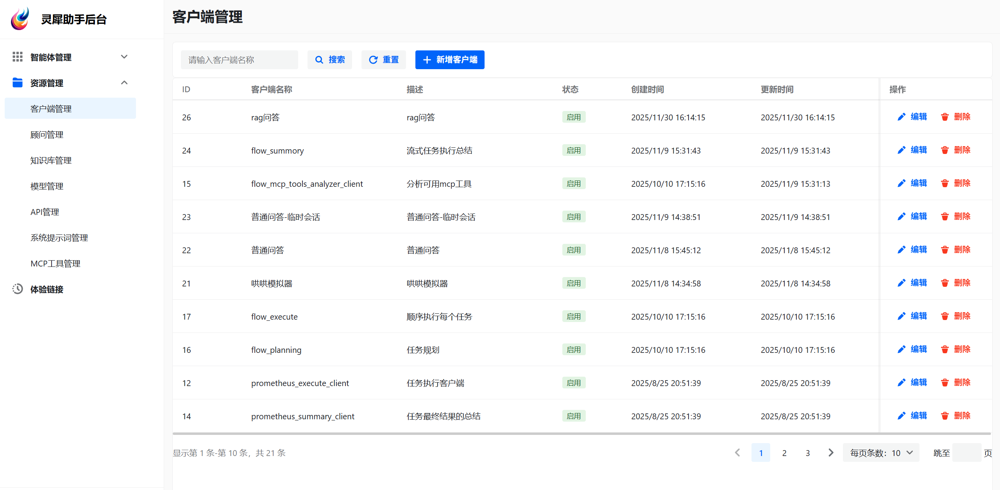

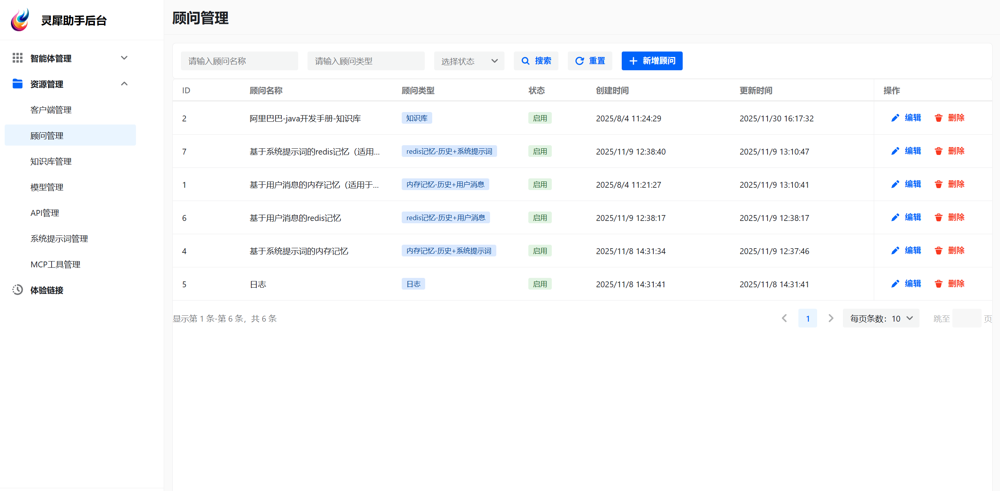

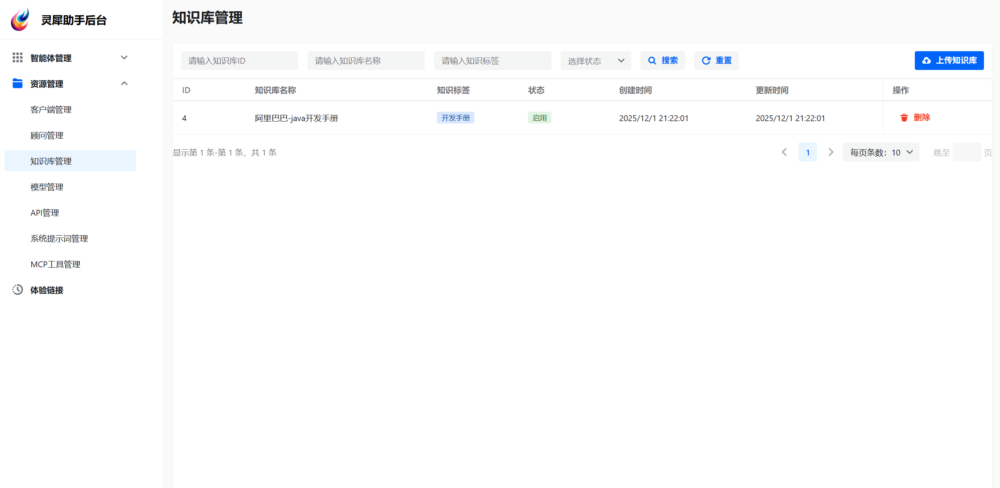

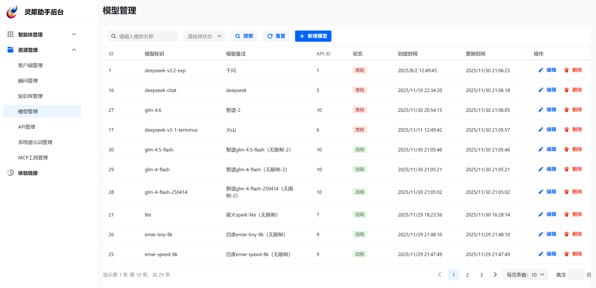

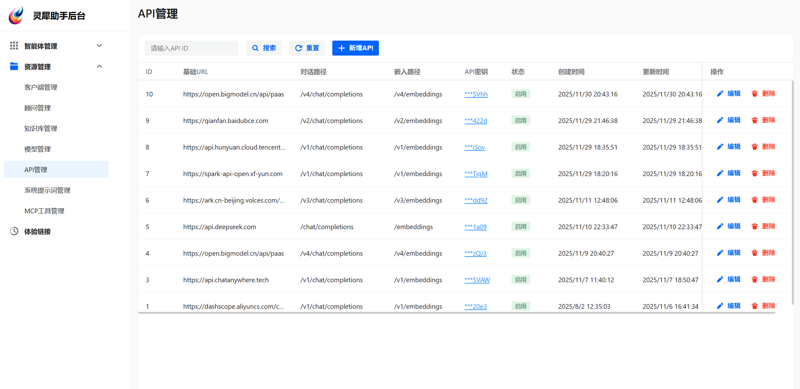

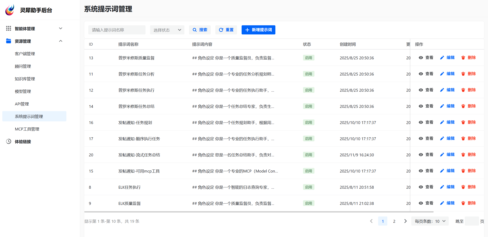

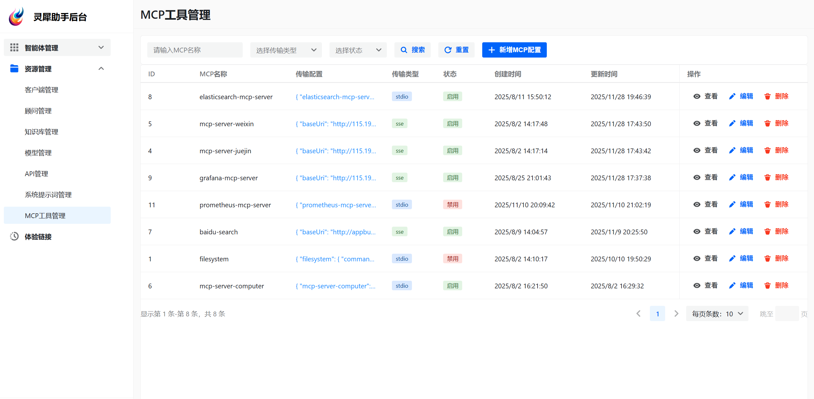
