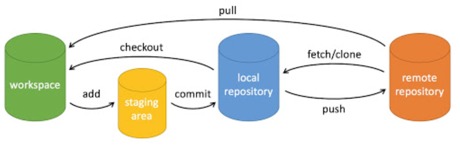

# Git
 
 
 
 

<Linkcard url="https://git-scm.com" title="git 官网" description="https://git-scm.com" logo="https://markdown-my.oss-cn-beijing.aliyuncs.com/picture/202508181534772.png"></Linkcard>

## 1. 是什么
一个分布式版本控制工具，方便团队协作

## 2. 平台
Github、Gitlab、Gitee等

## 3. 下载安装
### 3.1. 下载git
<Linkcard url="https://git-scm.com/downloads" title="下载 git" description="https://git-scm.com/downloads" logo="https://markdown-my.oss-cn-beijing.aliyuncs.com/picture/202508181534772.png"></Linkcard>
### 3.2. 安装完成后打开`Git Bash`


### 3.3. 然后在命令行`Git Bash`中输入

::: code-group
```bash
git config --global user.name "your_name"
git config --global user.email "your_email"
```
:::

## 4. 常见命令
<Linkcard url="https://www.runoob.com/manual/git-guide/" title="简明指南，快速上手" description="https://www.runoob.com/manual/git-guide/" logo="https://markdown-my.oss-cn-beijing.aliyuncs.com/picture/202508181539171.png"></Linkcard>

生成公私钥 `ssh-keygen -t ed25519 -C "邮箱"`

公钥放github上



+ workspace：工作区
+ staging area：暂存区/缓存区
+ local repository：版本库或本地仓库
+ remote repository：远程仓库

#### 4.1. 本地操作

| **命令**                                              | **作用**                              |
|-----------------------------------------------------|-------------------------------------|
| `git init`                                          | 初始化仓库                               |
| `git add <filename>`/`git add .`                    | 添加文件到暂存区                            |
| `git reset <filename>`                              | 将文件取消暂存                             |
| `git commit -m "commit-message"`                    | 将暂存区的内容添加到本地仓库中                     |
| `git branch`                                        | 查看当前分支                              |
| `git branch <branch>`                               | 创建分支                                |
| `git checkout <branch>`                             | 切换分支                                |
| `git checkout -b <branch>`/`git switch -c <branch>` | 创建并切换分支                             |
| `git branch -d <branch>`                            | 删除分支                                |
| `git merge <branch>`                                | 将分支合并到当前分支                          |
| `git checkout -- <filename>`                        | 使用已经提交的本地仓库中的内容替换当前内容               |
| `git log`                                           | 查看详细提交记录                            |
| `git reflog`                                        | 查看简介提交记录                            |
| `git tag 1.0.0 1b2e1d63ff`                          | 将提交ID前10位是1b2e1d63ff创建一个1.0.0的标签    |
| `git reset --hard <commitId>`                       | 回退到指定版本，commitId使用git log查看         |
| `git diff <source_branch> <target_branch>`          | 查看分支间的差异                            |
| `git diff <filename>`                               | 查看单个文件的差异                           |
| `git rm`                                            | 将文件从暂存区和工作区中删除                      |
| `git mv`                                            | 移动/重命名工作区文件                         |
| `git switch`（2.23版本引入）                              | 更清晰的切换分支                            |
| `git restore`（2.23版本引入）                             | 恢复/撤销文件的更改                          |
| `git clone`                                         | 拷贝远程仓库                              |
| `git status`                                        | 查看仓库状态，显示有变更的文件                     |
| `git diff`                                          | 比较文件的不同，即暂存区和工作区的差异                 |
| `git range-diff`                                    | 比较两个提交范围之间的差异                       |
| `git notes`                                         | 添加注释                                |
| `git show`                                          | 显示git对象的详细信息                        |
| `git log`                                           | 查看历史提交记录                            |
| `git blame <file>`                                  | 以列表形式查看指定文件的历史修改记录                  |
| `git shortlog`                                      | 简洁的提交日志                             |
| `git describe`                                      | 生成一个可读的字符串，该字符串基于 Git 的标签系统来描述当前的提交 |


#### 4.2.  远程操作

| **命令**                                                    | **作用**            |
|-----------------------------------------------------------|-------------------|
| `git clone username@host:/path/to/repository`             | 拉取远程仓库            |
| `git remote add origin username@host:/path/to/repository` | 将本地仓库连接到远程仓库      |
| `git push origin <branch>`                                | 上传远程代码            |
| `git fetch origin <branch>`                               | 从远程获取代码           |
| `git pull origin <branch>`                                | 更新代码（fetch并merge） |
| `git submodule`                                           | 管理包含其他git仓库的项目    |

#### 4.3. 个性化git

| **命令**                             | **作用**               |
|------------------------------------|----------------------|
| `gitk`                             | 内置图形化git             |
| `git config color.ui true`         | 彩色git输出              |
| `git config format.pretty oneline` | 显示历史记录时，每个提交的信息只显示一行 |
| `git add -i`                       | 交互式添加文件到暂存区          |


## 5. 使用示例

下面是一个从零开始拷贝远程仓库、创建分支、提交到远程仓库的例子：

::: code-group
```bash
# 1.克隆远程仓库
git clone username@host:/path/to/repository

# 2.创建一个叫做feature_x的分支，并切换过去
git checkout -b feature_x

# 3.添加文件到暂存区
git add <filename> / git add *

# 4.提交
git commit -m "代码提交信息"

# 5.推送feature_x分支（可选）
git push origin feature_x

# 6.切换回主分支
git checkout master

# 7.将feature_x分支合并到当前(master)分支
git merge feature_x

# 8.删除feature_x分支
git branch -d feature_x
```
:::

当然，你也可以使用像idea等编译器直接图形化操作

## 6. 团队合作的方式

+ owner创建好仓库，其他用户fork该仓库，在fork的仓库上进行开发
+ owner创建好仓库，给团队内成员分配权限，直接在同一个仓库内进行开发

如何创建一个 Pull Request

1. 创建主分支main
2. 创建feature分支
3. 创建一个feature到main的Pull Request

## 7. 常见的一些基本概念

保护分支：防止用户直接向主干分支提交代码，必须通过PR来进行合入

Code Review，CI：都是在合入前的检查策略，Code Review是人工进行检查，CI是通过一些定制化脚本检查

版本控制：一种记录一个或若干文件内容变化，以便将来查阅特定版本修订情况的系统

## 8. 连接不到github解决方案

在.ssh文件夹下创建config文件

```
Host github.com
User xxx@qq.com(注册时的邮箱)
Hostname ssh.github.com
PreferredAuthentications publickey
IdentityFile ~/.ssh/id_rsa
Port 443
```

**🥳 将来的你，一定会感谢现在努力奋斗的你，加油！💯**
